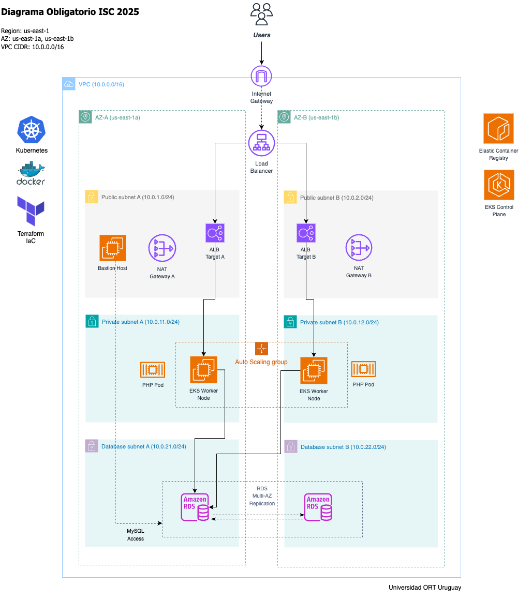

# 🚀 Obligatorio de Implementación de Soluciones Cloud 2025

Migración de e-commerce PHP a Amazon EKS con arquitectura cloud-native tolerante a fallas.

## 📋 Tabla de Contenidos

- [🎯 Objetivos del Proyecto](#-objetivos-del-proyecto)
- [🏗️ Arquitectura](#️-arquitectura)
- [📊 Estructura del Proyecto](#-estructura-del-proyecto)
- [🔧 Stack de Tecnologías](#-stack-de-tecnologias)
- [🚀 Guía de Implementación](#-guía-de-implementación)
- [📈 Características Implementadas](#-características-implementadas)
- [🗄️ Gestión de Base de Datos](#️-gestión-de-base-de-datos)
- [🔒 Buenas Prácticas de Seguridad](#-buenas-prácticas-de-seguridad)
- [🧪 Testing y Verificación](#-testing-y-verificación)
- [🚨 Troubleshooting](#-troubleshooting)
- [📚 Documentación](#-documentación)

## 🎯 Objetivos del Proyecto

Este proyecto implementa la migración de un e-commerce PHP desde infraestructura on-premise hacia AWS, cumpliendo con los siguientes objetivos:

### Requerimientos Académicos
- **Materia**: Implementación de Soluciones Cloud
- **Carrera**: Analista en Infraestructura Informática
- **Universidad**: ORT Uruguay
- **Entrega**: 26 de Junio 2025

### Objetivos Técnicos
- ✅ **Alta disponibilidad** y tolerancia a fallas Multi-AZ
- ✅ **Escalabilidad automática** ante picos de tráfico
- ✅ **Arquitectura cloud-native** con Kubernetes y contenedores
- ✅ **Infrastructure as Code** completamente automatizada
- ✅ **Security best practices** con grupos de seguridad restrictivos
- ✅ **Acceso administrativo seguro** con bastion host

## 🏗️ Arquitectura

### Diagrama de Arquitectura



### Componentes Principales

El diagrama muestra una **arquitectura de 3 capas** altamente disponible:

**🌐 Capa de Red (Networking Layer)**
- **Internet Gateway** para conectividad externa
- **NAT Gateways** redundantes en cada AZ para salida segura
- **VPC Multi-AZ** con separación por función (10.0.0.0/16)

**⚖️ Capa de Aplicación (Application Layer)**
- **Classic Load Balancer** creado automáticamente por Kubernetes
- **EKS Control Plane** gestionado por AWS (multi-AZ automático)
- **Worker Nodes** en subnets privadas con Auto Scaling Groups
- **PHP Pods** escalando automáticamente según demanda
- **Bastion Host** para administración segura

**💾 Capa de Datos (Data Layer)**  
- **RDS MySQL Multi-AZ** con primary/standby automático
- **Subnets de base de datos** aisladas para máxima seguridad
- **Backup automático** con 7 días de retención

**🛡️ Servicios Complementarios**
- **Amazon ECR** para registry de imágenes Docker
- **Security Groups** restrictivos por componente
- **AWS Academy** compatibility para entorno educativo

## 📊 Estructura del Proyecto

```
obligatorio-cloud/
├── 📁 docs/                           # Documentación técnica
│   └── architecture/                  # Diagrama de arquitectura
├── 📁 infrastructure/                 # Infrastructure as Code
│   └── terraform/                     # Módulos Terraform
│       ├── modules/                   # Módulos reutilizables
│       │   ├── vpc/                   # Configuración de VPC
│       │   ├── eks/                   # Configuración de Cluster Kubernetes
│       │   ├── rds/                   # Configuración de Base de datos MySQL
│       │   ├── security/              # Configuración de Security Groups
│       │   └── bastion/               # Configuración de bastión de administración
│       └── environments/              # Separación por ambiente
│           └── prod/                  # Ambiente de producción
├── 📁 application/                    # Aplicación e-commerce
│   ├── src/                           # Código fuente PHP
│   ├── docker/                        # Dockerfile
│   ├── k8s/                           # Manifiestos Kubernetes
│   └── scripts/                       # Scripts de automatización
│       ├── build-and-push.sh          # Build y push a ECR
│       ├── deploy-to-eks.sh           # Deploy automatizado a EKS
│       ├── entrypoint.sh              # Inicialización de contenedor
│       └── health-check.sh            # Health checks para contenedor
└── 📁 .gitignore, README.md, etc.     # Archivos raíz
```

**Nota**: Durante el deployment se genera temporalmente un directorio `k8s-generated/` con manifiestos con valores reales de la infraestructura. Estos archivos no se versionan por seguridad.

## 🔧 Stack de Tecnologías

### ☁️ Cloud Provider
- **AWS** como proveedor principal
- **Multi-AZ deployment** para alta disponibilidad
- **Region**: us-east-1 
- **AWS Academy** compatible para entorno educativo

### 🏗️ Infrastructure as Code
- **Terraform** con módulos personalizados
- **State management** local para AWS Academy
- **Configuración declarativa** de toda la infraestructura

### 🐳 Containerización
- **Docker** para empaquetado de aplicación
- **Amazon ECR** como registry de imágenes
- **PHP 8.2 + Apache** optimizado para producción
- **Logs dirigidos a stdout/stderr** para observabilidad en Kubernetes

### ⚙️ Orquestación
- **Amazon EKS** (Kubernetes 1.33)
- **Managed Node Groups** para worker nodes
- **Classic Load Balancer** vía Service LoadBalancer
- **Horizontal Pod Autoscaler** para escalado automático

### 💻 Aplicación
- **PHP 8.2** con Apache como web server
- **MySQL 8.0** como base de datos
- **Configuración cloud-native** con variables de entorno
- **Sistema de logs unificado** (Apache + PHP → stdout/stderr)

### 🔧 Herramientas DevOps
- **AWS CLI** para interacción con servicios
- **kubectl** para gestión de Kubernetes
- **Scripts bash automatizados** para deployment

## 🚀 Guía de Implementación

### 📋 Prerrequisitos

1. **AWS Academy Lab** activo:
   ```bash
   # Iniciar lab de AWS Academy
   # Obtener credenciales temporales
   # Descargar vockey.pem key pair
   ```

2. **Herramientas requeridas**:
   ```bash
   # AWS CLI
   aws --version          # >= 2.0
   
   # Terraform
   terraform --version    # >= 1.5
   
   # Docker
   docker --version       # >= 20.0
   
   # kubectl
   kubectl version        # >= 1.28
   ```

3. **Configuración AWS Academy**:
   ```bash
   # Configurar credenciales temporales de AWS Academy
   aws configure set aws_access_key_id ASIA...
   aws configure set aws_secret_access_key ...
   aws configure set aws_session_token ...
   aws configure set region us-east-1
   
   # Configurar vockey key pair
   cp vockey.pem ~/.ssh/vockey.pem
   chmod 400 ~/.ssh/vockey.pem
   ```

### 🏗️ Paso 1: Desplegar Infraestructura

```bash
# 1. Clonar repositorio
git clone https://github.com/lr251516/obligatorio-cloud.git
cd obligatorio-cloud

# 2. Navegar a directorio de Terraform
cd infrastructure/terraform/environments/prod

# 3. Inicializar Terraform
terraform init

# 4. Planificar cambios
terraform plan

# 5. Aplicar infraestructura
terraform apply
```

⏱️ **Tiempo estimado: ~15 minutos**

El deployment de infraestructura toma aproximadamente 15 minutos en completarse. Los componentes que más tiempo requieren son:
- **EKS Cluster**: ~10-12 minutos (creación del control plane y node groups)
- **RDS Multi-AZ**: ~8-10 minutos (instancia primaria + standby)
- **VPC y componentes de red**: ~2-3 minutos

Durante este tiempo puedes preparar las herramientas para los siguientes pasos.

### 🐳 Paso 2: Build y Push de Imagen Docker

```bash
# Navegar a directorio de aplicación
cd application/

# Ejecutar script automatizado de build y push
./scripts/build-and-push.sh

# El script automáticamente:
# 1. Verifica dependencias (Docker, AWS CLI)
# 2. Obtiene información de AWS (Account ID, región)
# 3. Crea repositorio ECR si no existe
# 4. Realiza login en ECR
# 5. Construye imagen optimizada con platform linux/amd64
# 6. Tagea imagen para ECR registry
# 7. Sube imagen a ECR con tag latest
# 8. Opcional: limpia imágenes locales para ahorrar espacio
```

**Opciones del script build-and-push.sh:**
```bash
# Ayuda
./scripts/build-and-push.sh --help
```

### ⚓ Paso 3: Deploy a Kubernetes

```bash
# Ejecutar script de deploy automatizado
./scripts/deploy-to-eks.sh

# El script automáticamente:
# 1. Verifica dependencias (kubectl, terraform, curl)
# 2. Obtiene outputs dinámicos de Terraform (DB endpoint, cluster name, etc.)
# 3. Configura kubectl con el cluster EKS
# 4. Genera manifiestos en k8s-generated/ con valores reales
# 5. Aplica recursos a Kubernetes en orden correcto
# 6. Verifica que deployment sea exitoso
# 7. Limpia archivos temporales
```

**¿Qué hace el script deploy-to-eks.sh?**
- Genera manifiestos dinámicos con valores reales de la infraestructura
- Configura secrets con credenciales reales de RDS
- Actualiza ConfigMap con endpoint real de base de datos
- Aplica recursos en el orden correcto (namespace → secrets → config → deployment → service)
- Verifica el estado de los pods y servicios

### 🌐 Paso 4: Acceder a la Aplicación E-commerce

Una vez completado el deployment, obtén la URL de acceso público:

```bash
# Obtener URL del Classic Load Balancer
kubectl get service ecommerce-service -n ecommerce -o jsonpath='{.status.loadBalancer.ingress[0].hostname}'

# Ejemplo de output:
# a1234567890abcdef-1234567890.us-east-1.elb.amazonaws.com
```

#### 🛒 **Acceso a la Tienda Online**

```bash
# Construir URL completa de la aplicación
echo "http://$(kubectl get service ecommerce-service -n ecommerce -o jsonpath='{.status.loadBalancer.ingress[0].hostname}')"

# Abrir en navegador (ejemplo)
# http://a1234567890abcdef-1234567890.us-east-1.elb.amazonaws.com
```

**Funcionalidades disponibles:**
- ✅ **Catálogo de productos** - Página principal con productos
- ✅ **Carrito de compras** - Agregar/quitar productos
- ✅ **Búsqueda por categorías** - Filtros de productos
- ✅ **Páginas informativas** - About, FAQ, Contact

#### ⏱️ **Nota importante sobre el Load Balancer**

El Classic Load Balancer puede tardar **2-5 minutos** en estar completamente disponible después del deployment. Si la URL no responde inmediatamente:

```bash
# Verificar estado del service
kubectl describe service ecommerce-service -n ecommerce

# Verificar que los pods estén ready
kubectl get pods -n ecommerce

# Verificar logs si hay problemas
kubectl logs -f deployment/ecommerce-php -n ecommerce
```

### 🌐 Paso 5: Verificar Funcionamiento

```bash
# Verificar pods
kubectl get pods -n ecommerce

# Ver logs de aplicación
kubectl logs -f deployment/ecommerce-app -n ecommerce

# Test básico de conectividad
LB_URL=$(kubectl get service ecommerce-service -n ecommerce -o jsonpath='{.status.loadBalancer.ingress[0].hostname}')
curl -I http://$LB_URL
```

### 🛒 Paso 6: Cargar Datos de Ejemplo

Para probar la funcionalidad del e-commerce, puedes cargar productos de ejemplo en la base de datos:

```bash
# 1. Conectar al bastion host
ssh -i ~/.ssh/vockey.pem ec2-user@$(terraform output -raw bastion_public_ip)

# 2. Conectar a MySQL usando el script incluido
./connect-mysql.sh

# 3. Cargar datos de ejemplo
# Ver instrucciones detalladas y queries en: infrastructure/terraform/modules/rds/README.md
```

**📚 Documentación completa de base de datos:**
- **Queries de ejemplo:** `infrastructure/terraform/modules/rds/README.md`
- **Productos de muestra:** Scripts SQL para cargar productos en diferentes categorías
- **Administración:** Queries útiles para gestión de productos y categorías

Una vez cargados los datos, podrás:
- ✅ **Ver productos** en la página principal del e-commerce
- ✅ **Filtrar por categorías** (Electronics, Clothing)
- ✅ **Ver detalles** de cada producto con imágenes

## 🔒 Buenas Prácticas de Seguridad

### Archivos Sensibles Protegidos

El `.gitignore` mejorado protege información sensible:

```bash
# Archivos de infraestructura
*.tfstate              # Estados de Terraform
*.tfvars               # Variables sensibles
.terraform/            # Cache de Terraform

# Archivos de Kubernetes generados dinámicamente
k8s-generated/         # Manifiestos con valores reales
kubeconfig*            # Configuraciones de cluster

# Secretos y configuración
.env                   # Variables de entorno
.aws/                  # Credenciales AWS
*.pem                  # Claves SSH

# Logs y datos temporales
*.log                  # Archivos de log
uploads/               # Archivos subidos por usuarios
application/docker/volumes/  # Volúmenes locales
```

### Security Groups Implementados

- **Security Groups restrictivos** implementados por capas de seguridad
- **Configuración detallada** disponible en `infrastructure/terraform/modules/security/README.md`
- **Principios aplicados**: Least Privilege, Defense in Depth, Zero Trust

### Gestión de Secrets

- **Kubernetes Secrets**: Credenciales de base de datos encriptadas en etcd
- **Manifiestos dinámicos**: Los valores reales se generan en tiempo de deployment
- **No versionado de secretos**: Los archivos con valores reales no se suben al repositorio

## 📈 Características Implementadas

### 🔄 Alta Disponibilidad
- **Multi-AZ deployment** en us-east-1a y us-east-1b
- **RDS Multi-AZ** con failover automático
- **EKS worker nodes** distribuidos geográficamente
- **Classic Load Balancer** con health checks automáticos

### 📊 Escalabilidad Automática
- **Horizontal Pod Autoscaler (HPA)** basado en CPU/memoria
- **Auto Scaling Groups** para worker nodes de EKS
- **Configuración dinámica** de réplicas (2-10 pods)

### 🛡️ Seguridad
- **Security Groups** restrictivos por componente
- **Kubernetes Secrets** para credentials sensibles
- **Network isolation** entre capas de aplicación
- **Bastion host** para acceso administrativo seguro

### 🔧 Automatización
- **Infrastructure as Code** 100% con Terraform
- **Scripts automatizados** para build y deploy
- **Configuration as Code** con Kubernetes manifests
- **Gestión de secrets** automatizada
- **Deployment dinámico** con valores de Terraform

### 📱 Observabilidad y Logging
- **Health checks** en múltiples niveles
- **Logs unificados**: Apache y PHP logs van a stdout/stderr para Kubernetes
- **Readiness y liveness probes** configurados
- **Performance Insights** habilitado en RDS
- **Kubernetes native logging** accesible vía `kubectl logs`

## 🧪 Testing y Verificación

### ✅ Verificación de Infraestructura
```bash
# Verificar que todos los recursos estén creados
terraform output

# Comprobar estado del cluster EKS
aws eks describe-cluster --name obligatorio-eks-cluster

# Verificar RDS Multi-AZ
aws rds describe-db-instances --db-instance-identifier db-obligatorio
```

### ✅ Verificación de Acceso Web
```bash
# Verificar que la aplicación responde
LB_URL=$(kubectl get service ecommerce-service -n ecommerce -o jsonpath='{.status.loadBalancer.ingress[0].hostname}')

# Test página principal
curl -s http://$LB_URL | grep -i "yem-yem"

# Test admin login
curl -s http://$LB_URL/admin/login | grep -i "login"

# Verificar productos en la base de datos
kubectl exec -it deployment/ecommerce-php -n ecommerce -- \
  mysql -h $DB_HOST -u admin -padmin1234 ecommerce -e "SELECT COUNT(*) as productos FROM products;"
```

### ✅ Verificación de Aplicación
```bash
# Estado de pods
kubectl get pods -n ecommerce -o wide

# Estado de servicios y load balancer
kubectl get svc -n ecommerce

# Logs de aplicación (ahora van a stdout/stderr)
kubectl logs -f deployment/ecommerce-php -n ecommerce

# Test de conectividad a base de datos
kubectl exec -it deployment/ecommerce-php -n ecommerce -- php -r "
  include '/var/www/html/views/db.php';
  echo 'Conexión exitosa a: ' . \$host;
"
```

### ✅ Test de Load Balancer
```bash
# Obtener URL del Classic Load Balancer
LB_URL=$(kubectl get service ecommerce-service -n ecommerce -o jsonpath='{.status.loadBalancer.ingress[0].hostname}')

# Test de conectividad
curl -I http://$LB_URL

# Verificar aplicación funcionando
curl http://$LB_URL
```

### ✅ Test de Bastion y RDS
```bash
# Test de conectividad SSH al bastion
ssh -i ~/.ssh/vockey.pem ec2-user@$(terraform output -raw bastion_public_ip)

# Test de conectividad MySQL desde bastion
ssh -i ~/.ssh/vockey.pem ec2-user@$(terraform output -raw bastion_public_ip) \
  'mysql -h'"$(terraform output -raw db_endpoint)"' -uadmin -padmin1234 -e "SELECT VERSION();"'
```

## 🚨 Troubleshooting

### Problemas Comunes de MySQL

**Error: "ERROR 2002 (HY000): Can't connect to local MySQL server through socket"**
```bash
# Verificar que DB_HOST apunte al endpoint de RDS, no a localhost
kubectl get configmap ecommerce-config -n ecommerce -o yaml

# El DB_HOST debe ser algo como: obligatorio-rds.xxxxx.us-east-1.rds.amazonaws.com
# NO debe ser: localhost, 127.0.0.1 o mysql
```

**Error: "Access denied for user"**
```bash
# Verificar credenciales en el secret
kubectl get secret ecommerce-secret -n ecommerce -o yaml

# Decodificar credenciales
echo "YWRtaW4=" | base64 -d  # Debe mostrar: admin
```

**Error: "Unknown database 'ecommerce'"**
```bash
# Conectar desde bastion y crear base de datos
ssh -i ~/.ssh/vockey.pem ec2-user@BASTION_IP
mysql -h DB_ENDPOINT -u admin -padmin1234 -e "CREATE DATABASE IF NOT EXISTS ecommerce;"
```

### Problemas de Kubernetes

**Problema**: Pods en estado `ImagePullBackOff`
```bash
# Verificar que la imagen esté en ECR
aws ecr describe-images --repository-name ecommerce-php

# Verificar permisos de ECR en worker nodes
kubectl describe pod POD_NAME -n ecommerce
```

**Problema**: Classic Load Balancer no responde
```bash
# Verificar health checks
kubectl get endpoints -n ecommerce

# Verificar que los pods estén en estado Ready
kubectl get pods -n ecommerce -o wide

# Verificar logs de los pods
kubectl logs -f deployment/ecommerce-php -n ecommerce
```

**Problema**: No se puede conectar a RDS
```bash
# Verificar security groups desde dentro del pod
kubectl exec -it deployment/ecommerce-php -n ecommerce -- \
  nc -zv DB_ENDPOINT 3306

# Verificar desde el bastion
ssh -i ~/.ssh/vockey.pem ec2-user@BASTION_IP \
  'telnet DB_ENDPOINT 3306'
```

### Problemas de AWS Academy

**Problema**: Credenciales de AWS Academy expiran
```bash
# Renovar sesión del lab en AWS Academy
# Obtener nuevas credenciales temporales
aws configure set aws_access_key_id ASIA...
aws configure set aws_secret_access_key ...
aws configure set aws_session_token ...

# Verificar conectividad
aws sts get-caller-identity
```

**Problema**: No se puede hacer SSH al bastion
```bash
# Verificar permisos de la clave
chmod 400 ~/.ssh/vockey.pem

# Verificar IP del bastion
terraform output bastion_public_ip

# Verificar security group del bastion
aws ec2 describe-security-groups --group-names bastion-sg
```

### Scripts de Diagnóstico

**Script de verificación completa:**
```bash
#!/bin/bash
echo "=== Verificación de Estado Completa ==="

echo "1. Estado de Terraform:"
terraform output

echo "2. Estado de EKS:"
kubectl get nodes

echo "3. Estado de Aplicación:"
kubectl get all -n ecommerce

echo "4. Conectividad de Load Balancer:"
LB_URL=$(kubectl get service ecommerce-service -n ecommerce -o jsonpath='{.status.loadBalancer.ingress[0].hostname}')
curl -I http://$LB_URL

echo "5. Logs recientes:"
kubectl logs --tail=20 deployment/ecommerce-php -n ecommerce
```

## 📚 Documentación

### 📖 Documentos Incluidos
- **README principal** - Guía completa del proyecto
- **Módulos Terraform** - Documentación detallada de cada módulo:
  - `infrastructure/terraform/modules/vpc/README.md` - Configuración de red y subnets
  - `infrastructure/terraform/modules/eks/README.md` - Cluster Kubernetes y node groups
  - `infrastructure/terraform/modules/rds/README.md` - Base de datos MySQL Multi-AZ
  - `infrastructure/terraform/modules/security/README.md` - Security Groups por capas
  - `infrastructure/terraform/modules/bastion/README.md` - Host de administración
- **Manifiestos K8s** - Explicación de recursos Kubernetes (`application/k8s/README.md`)
- **Scripts de automatización** - Documentación inline en cada script

### 🔍 Comandos Útiles

**Scripts principales:**
```bash
./scripts/build-and-push.sh     # Build y push automatizado a ECR
./scripts/deploy-to-eks.sh      # Deploy automatizado a Kubernetes
./scripts/health-check.sh       # Health checks para contenedor
./scripts/entrypoint.sh         # Inicialización de contenedor (usado en Docker)
```

**Terraform**:
```bash
terraform plan -out=tfplan  # Planificar cambios
terraform apply tfplan      # Aplicar plan
terraform output            # Ver outputs de infraestructura
terraform destroy           # Destruir infraestructura (¡cuidado!)
```

**Kubernetes**:
```bash
kubectl get all -n ecommerce                     # Ver todos los recursos
kubectl describe pod <pod-name> -n ecommerce     # Detalles de pod
kubectl logs -f <pod-name> -n ecommerce          # Logs en tiempo real
kubectl exec -it <pod-name> -n ecommerce -- bash # Acceso shell
kubectl get hpa -n ecommerce                     # Ver auto scaling
```

**Docker**:
```bash
docker images                      # Listar imágenes
docker ps                         # Contenedores activos
docker logs <container-id>        # Ver logs
```

**AWS CLI**:
```bash
aws eks describe-cluster --name obligatorio-eks-cluster    # Info del cluster
aws rds describe-db-instances                              # Info de RDS
aws ec2 describe-instances --filters "Name=tag:Name,Values=*bastion*" # Info bastion
```

### 📊 Observabilidad y Logs

**Manejo mejorado de logs:**
- Los logs de Apache y PHP ahora se dirigen a `stdout/stderr`
- Esto permite usar `kubectl logs` para acceder a todos los logs
- Los logs están disponibles para herramientas de observabilidad de Kubernetes
- No se almacenan logs localmente en el contenedor (mejor para contenedores efímeros)

**Acceder a logs:**
```bash
# Logs en tiempo real
kubectl logs -f deployment/ecommerce-php -n ecommerce

# Logs de un pod específico
kubectl logs pod-name -n ecommerce

# Logs anteriores (si el pod se reinició)
kubectl logs deployment/ecommerce-php -n ecommerce --previous
```

## 🎓 Información Académica

### Universidad ORT Uruguay
- **Materia**: Implementación de Soluciones Cloud (ISC)
- **Proyecto**: Obligatorio 2025 

### Criterios de Evaluación Cumplidos
- ✅ **Tolerancia a fallas** - Multi-AZ deployment
- ✅ **Escalabilidad ante picos** - HPA y Auto Scaling
- ✅ **Firewall restrictivo** - Security Groups por capas
- ✅ **Mejoras propuestas** - Bastion host, contenedores, IaC
- ✅ **Documentación completa** - README y documentación técnica
- ✅ **Trabajo colaborativo** - Git con commits organizados
- ✅ **Buenas prácticas de seguridad** - Gitignore mejorado, secrets management
- ✅ **Automatización** - Scripts de build y deploy
- ✅ **Observabilidad** - Logs centralizados y health checks

## 📄 Licencia

MIT License - Este proyecto está disponible bajo la licencia MIT para fines educativos.

---